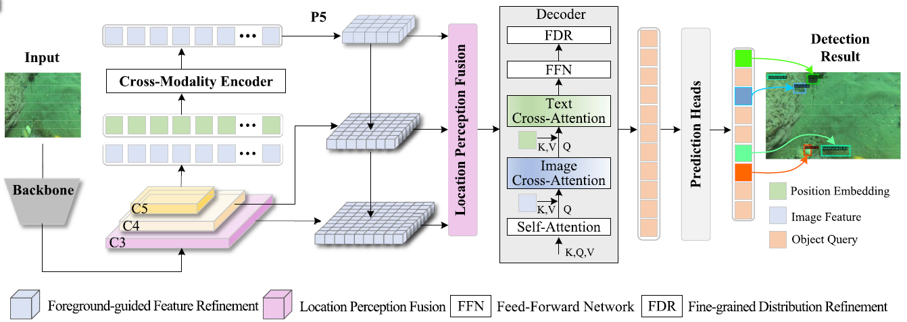

# DFFR: DETR With Foreground-Guided Feature Refinement Network for End-to-End Underwater Object Detection

Our paper accepted by IEEE TRANSACTIONS ON INDUSTRIAL INFORMATICS (TII).

## Introduction
Underwater object detection is a vital technology for marine resource exploration, autonomous underwater vehicles, and environmental monitoring.
Compared to land-based scenarios, this task is often hindered by challenging conditions, such as low contrast,
object occlusion, and image blurring, which severely degrade detection performance. 
To effectively address these issues, we propose the transformer-based detectors with foreground-guided feature refinement network (DFFR).
We first employ the lightweight high performance GPU network V2 (HGNetV2) backbone to extract multiscale deep
semantic features, while the subsequent cross-modal encoder further enriches these representations by integrating both visual and textual information. We then introduce the foreground-guided feature refinement module, which enables interlayer feature fusion using high-level contextual guidance to significantly improve foreground recognition. Concurrently, we propose the location perception fusion strategy, which integrates multiscale features to enhance their consistency and discriminative capabilities. Finally, the refined features are passed through a fine-grained distribution refinement module for iterative optimization of the output distribution. Comprehensive experimental results demonstrate that DFFR outperforms existing stateof-the-art methods in multiple metrics, including average



## Video Demo

The following video demonstrates the detection results of our method.

A sample video is available via Baidu Netdisk:

- Link: https://pan.baidu.com/s/1sFz2hkgrLqZVGXRDqMKpPg  
- Extraction Code: dffr  


## Environment

- OS: Windows 11
- Python: 3.11.9
- CUDA: 11.8
- PyTorch: >= 2.0.1
- torchvision: >= 0.15.2
- GPU: NVIDIA GeForce RTX 4060 Ti
- Supports single-GPU and multi-GPU (DDP) training


## Dependencies

- torch >= 2.0.1
- torchvision >= 0.15.2
- faster-coco-eval >= 1.6.6
- PyYAML
- tensorboard
- scipy
- calflops
- transformers
- loguru

## Datasets

**DUO**: https://github.com/chongweiliu/DUO


Other underwater datasets: https://github.com/mousecpn/Collection-of-Underwater-Object-Detection-Dataset


It is recommended to symlink the dataset root to `$data`.

```
├── data
│   ├── DUO
│   │   ├── annotaions
│   │   ├── train2017
│   │   ├── test2017
│   ├── UTDAC2020
│   │   ├── annotaions
│   │   ├── train
│   │   ├── test
```
## Train

```
python train.py -c configs/dffr/dffr_hgnetv2_l_DUO.yml --use-amp --seed=0 --device cuda:0
```

## Test

```
python train.py -c configs/dffr/dffr_hgnetv2_l_DUO.yml --test-only -r xx.pth
```


## Project Files

Full project files can be downloaded from Baidu Netdisk:

Link: https://pan.baidu.com/s/1ceg8WOoyTM6T1qGCV8jILg  
Extraction Code: 2387

## Checkpoints

We provide the most recent trained weights of our method for testing and reproducibility.

- Link: https://pan.baidu.com/s/1aO7cwVzvwE34UCgxYVBO8Q
- Extraction Code: 1456

## Citation
```
@ARTICLE{11360781,
  author={Zhao, Gaoli and Zhang, Kefei and Wu, Yuheng and Liang, Zheng and Zhao, Wenyi and Zhang, Weidong},
  journal={IEEE Transactions on Industrial Informatics}, 
  title={DFFR: DETR With Foreground-Guided Feature Refinement Network for End-to-End Underwater Object Detection}, 
  year={2026},
  volume={22},
  number={4},
  pages={3158-3168},
  keywords={Feature extraction;Detectors;Decoding;Semantics;YOLO;Transformers;Accuracy;Real-time systems;Training;Robustness;Cross-modality encoder;foreground-guided feature refinement (FFR);location perception fusion (LPF);underwater object detection (UOD)},
  doi={10.1109/TII.2025.3649916}}
```


## Acknowledgement
Thanks to the open-source community for their valuable contributions.
We sincerely appreciate the MMDetection team for their excellent detection framework.
We also thank the developers of D-FINE and RT-DETR for their inspiring open-source work, which provides important references and support for this project.


